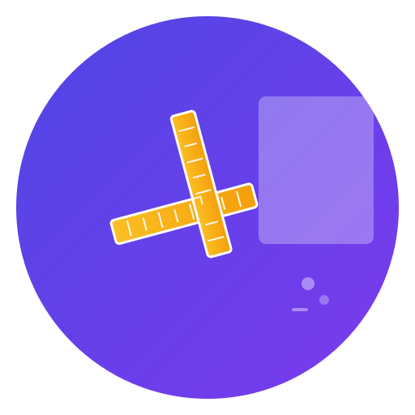

# 🎨 Templator - Adobe Template Generator

> Générateur professionnel de templates Adobe avec 100+ formats pour réseaux sociaux, impression, web et vidéo.



## ✨ Fonctionnalités

- **Templates pré-configurés** pour réseaux sociaux, impression, web et vidéo
- **Dimensions exactes** selon les standards de chaque plateforme
- **Marges et guides automatiques** pour un placement optimal du contenu
- **Zones de sécurité** pour éviter les coupures indésirables
- **Fonds perdus** pour les projets d'impression
- **Formats multiples** : PSD, AI, JPG, PNG, PDF
- **Résolutions adaptées** : 72 DPI (web), 150 DPI (qualité), 300 DPI (impression)
- **Interface intuitive** avec aperçu en temps réel

## 📋 Templates Disponibles (100+ formats)

### 📱 Réseaux Sociaux (30+ formats)
**Facebook** : Profil, Couverture, Posts (carré/portrait), Story, Marketplace  
**Instagram** : Profil, Posts (carré/portrait/paysage), Story, Highlights  
**X/Twitter** : Profil, En-tête, Posts (carré/paysage), Publicités  
**YouTube** : Profil chaîne, Bannière, Miniatures, Shorts  
**LinkedIn** : Profil, Couverture, Logo/Couverture entreprise, Posts  
**TikTok** : Profil, Vidéos verticales  
**Pinterest** : Profil, Couverture, Épingles, Stories  
**Snapchat** : Profil, Geofilters, Publicités

### 🎮 Plateformes Spécialisées (15+ formats)
**Discord** : Icônes serveur, Bannières  
**Twitch** : Profil, Bannières, Overlays stream  
**Steam** : Capsules jeu, En-têtes  
**Reddit** : Bannières subreddit, Icônes  
**Spotify** : Couvertures playlist/podcast  
**WhatsApp** : Statuts Business  
**Telegram** : Photos chaînes  
**Clubhouse** : Photos profil

### 🖨️ Impression (20+ formats)
**Affiches** : A0, A1, A2, A3 (jusqu'à 841×1189 mm)  
**Flyers** : A4, A5, A6 (210×297 mm à 105×148 mm)  
**Cartes de visite** : Europe (85×55 mm), USA (89×51 mm)  
**Brochures** : Tri-fold, Bi-fold A4  
**Magazines** : A4, Livre de poche  
**Publicitaire** : Kakémonos, Roll-ups (85×200 cm)  
**Enveloppes** : DL, C4

### 🌐 Web (15+ formats)
**Bannières pub** : Leaderboard, Rectangle, Gratte-ciel  
**Hero sections** : Desktop FHD/Ultra-large, Tablette, Mobile  
**E-commerce** : Images produits carrées/paysage  
**Blog** : Images articles, Miniatures

### 🎬 Vidéo (20+ formats)
**Horizontaux** : 720p, 1080p, 4K, 8K (16:9)  
**Verticaux** : HD, Full HD, 4K (9:16) pour TikTok/Stories  
**Carrés** : HD, Full HD (1:1) pour posts sociaux  
**Cinéma** : 2K/4K DCI (17:9)  
**Spéciaux** : Ultra-large (21:9), Podcasts  
**Streaming** : 720p/1080p pour Twitch, YouTube Live

## 🚀 Utilisation

1. **Ouvrez** `index.html` dans votre navigateur web
2. **Sélectionnez** une catégorie (Réseaux Sociaux, Impression, Web, Vidéo)
3. **Choisissez** le template désiré dans la grille
4. **Configurez** les options :
   - Format de fichier (PSD, AI, JPG, PNG, PDF)
   - Résolution (72, 150, 300 DPI)
   - Mode couleur (RGB, CMYK)
   - Guides et marges
   - Fonds perdus (impression)
5. **Cliquez** sur "Générer le template"
6. **Téléchargez** votre fichier prêt à utiliser

## 📐 Spécifications Techniques

### Marges Standards
- **Réseaux sociaux** : 5% des dimensions
- **Impression** : 20-30mm selon le format
- **Web** : 10-15% des dimensions
- **Vidéo** : 10% des dimensions avec zone de sécurité étendue

### Zones de Sécurité
- **Stories Instagram** : 250px en haut/bas (zone d'interface)
- **YouTube** : 160px sur les côtés (zone de contrôles)
- **Impression** : 5mm minimum du bord
- **Télévision** : 15% des dimensions (zone de sécurité TV)

### Fonds Perdus
- **Standard** : 3-10mm selon le format
- **Grande impression** : 10mm minimum
- **Cartes de visite** : 3mm

## 🎯 Conseils d'Utilisation

### Pour les Réseaux Sociaux
- Utilisez **RGB** et **72 DPI** pour l'affichage écran
- Respectez les **zones de sécurité** pour éviter les coupures
- Testez sur mobile pour les stories verticales

### Pour l'Impression
- Utilisez **CMYK** et **300 DPI** pour la qualité optimale
- Activez les **fonds perdus** pour éviter les bordures blanches
- Vérifiez les **marges** pour le texte important

### Pour le Web
- **RGB** et **72 DPI** suffisent pour l'affichage
- Optimisez la **taille de fichier** avec JPG pour les photos
- Utilisez **PNG** pour les éléments avec transparence

### Pour la Vidéo
- Respectez les **zones de sécurité** pour les sous-titres
- **16:9** pour YouTube, **9:16** pour TikTok/Instagram
- Testez sur différents appareils

## 🔧 Personnalisation

Vous pouvez facilement ajouter de nouveaux templates en modifiant le fichier `templates-data.js` :

```javascript
{
    id: 'mon-template',
    name: 'Mon Template Custom',
    dimensions: '1000 × 800 px',
    width: 1000,
    height: 800,
    description: 'Description de mon template',
    margins: { top: 80, right: 100, bottom: 80, left: 100 },
    safeZone: { top: 40, right: 50, bottom: 40, left: 50 },
    category: 'custom'
}
```

## 📱 Compatibilité

- **Navigateurs** : Chrome, Firefox, Safari, Edge (versions récentes)
- **Appareils** : Desktop, tablette, mobile (responsive)
- **Logiciels Adobe** : Photoshop, Illustrator, InDesign

## 🔧 Comment ça marche

### Format PSD
L'application génère **2 fichiers** :
1. **Un fichier PNG** avec les guides visuels et dimensions exactes
2. **Un fichier d'instructions** détaillé pour créer le PSD dans Photoshop

**Pourquoi cette approche ?**
- Les vrais fichiers PSD sont complexes et nécessitent des bibliothèques spécialisées
- Cette méthode vous donne un contrôle total sur la création de votre document
- Vous obtenez les spécifications exactes pour configurer Photoshop correctement

### Format AI (Illustrator)
Génère un **fichier SVG** que vous pouvez ouvrir directement dans Illustrator :
- Ouvrez le fichier .svg dans Illustrator
- Tous les guides et zones sont préservés
- Sauvegardez ensuite au format .ai

### Formats Image (JPG/PNG/PDF)
Génèrent des **images haute résolution** avec :
- Guides visuels intégrés
- Zones de contenu marquées
- Spécifications techniques affichées

## 🆘 Support

Pour toute question ou suggestion d'amélioration :
- Vérifiez que votre navigateur supporte HTML5 Canvas
- Suivez les instructions détaillées fournies avec chaque template PSD
- Les fichiers SVG s'ouvrent directement dans Illustrator
- Pour l'impression, utilisez toujours 300 DPI et CMYK

## 📄 Licence

Ce projet est libre d'utilisation pour vos projets personnels et commerciaux.

---

**Créé avec ❤️ pour optimiser votre workflow créatif Adobe**
